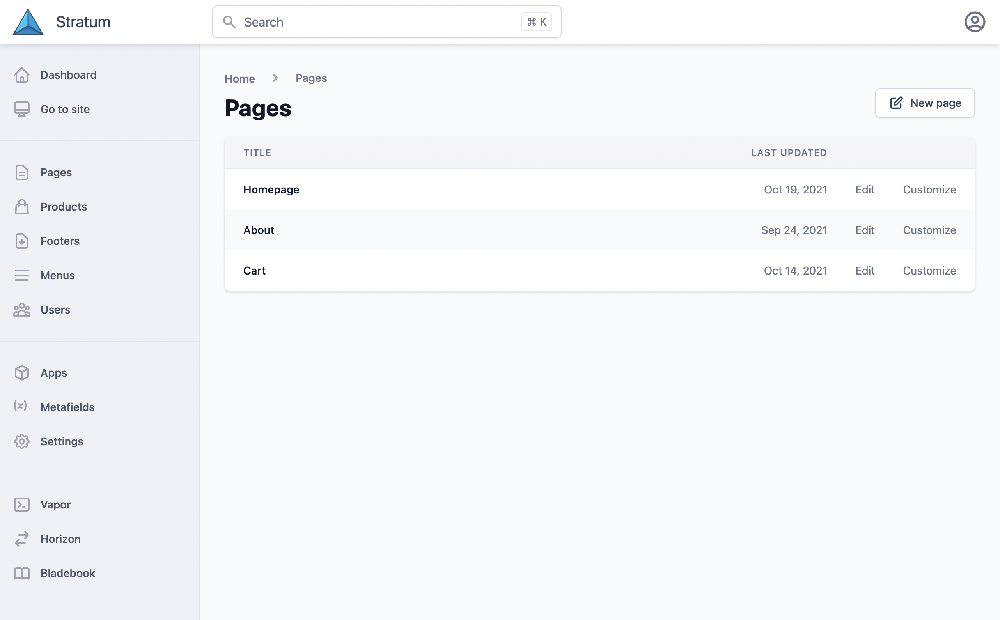

# Strata

<figure><figcaption></figcaption></figure>

Developer and product team friendly content management system.

<table data-view="cards"><thead><tr><th></th><th></th><th></th><th data-hidden data-card-target data-type="content-ref"></th></tr></thead><tbody><tr><td><h4 id="intro-laravel">Templating with Laravel's Blade engine</h4>
Blade is a powerful, simple, and beautiful templating language, and now you can use it for your static sites, not just your Laravel-powered apps.
</td><td></td><td></td><td><a href="./">.</a></td></tr><tr><td></td><td></td><td></td><td></td></tr><tr><td></td><td></td><td></td><td></td></tr></tbody></table>
